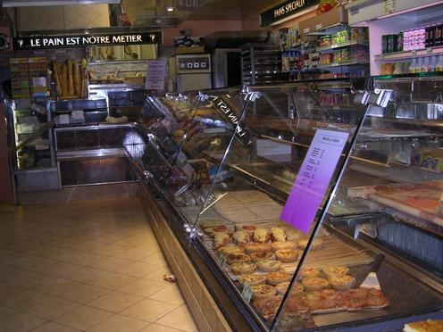

# Classifying MIT Indoor Scenes Dataset 
| An amphitheater  | A bakery |
| ------------- | ------------- |
|   |   |

Image classification using *Tensorflow Keras*.
## Workflow
1. `data-arrangement.py`: What we get from Kaggle is images in a file and two text files splitting these images to training and test sets. Here, we split images to train, validation and test sets without causing to any imbalance. After the process, we have 4680 samples for training, 670 for validation and 1340 for testing.
2. `preprocessing-and-baseline.py`: This is the process of rescaling images and creating Python iterators (image batches) for the neural network. We also build a simple convolutional neural network and train it.
3. `baseline-review`: We plot the learning curves and see that our model suffers from overfitting. We decide on a strategy to mitigate overfitting.
4. `model-building.py`: Augmenting existing data to increase training set size, then using a pretrained convnet to utilize a better trained model's parameters.
5. `final-eval.ipynb`: Evaluating our model's performance on test data.
