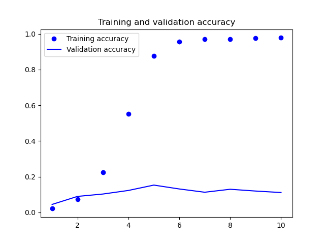
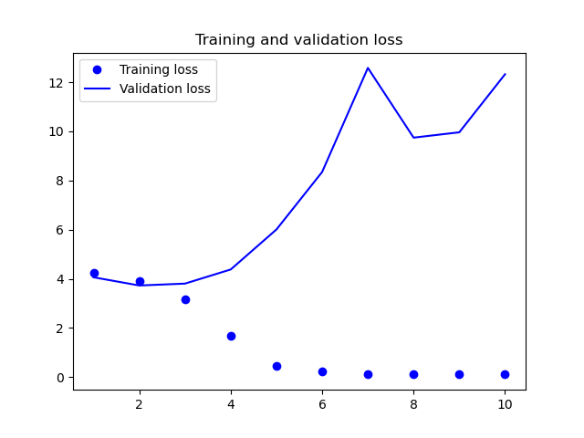

# Baseline Review
| Accuracy  | Loss |
| ------------- | ------------- |
|   |   |

We can easily see that our problem is overfitting. Since we have relatively small sample size, it may help us to use data augmentation, and we will also use
a dropout layer to mitigate overfitting. Our model's convolution part will be a pretrained convnet, that is a convolutional neural network trained on a large dataset and is
available inside Tensorflow Keras. We will freeze its parameters.
